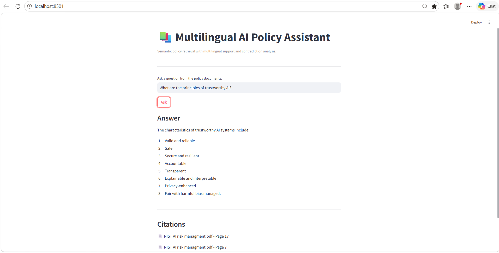
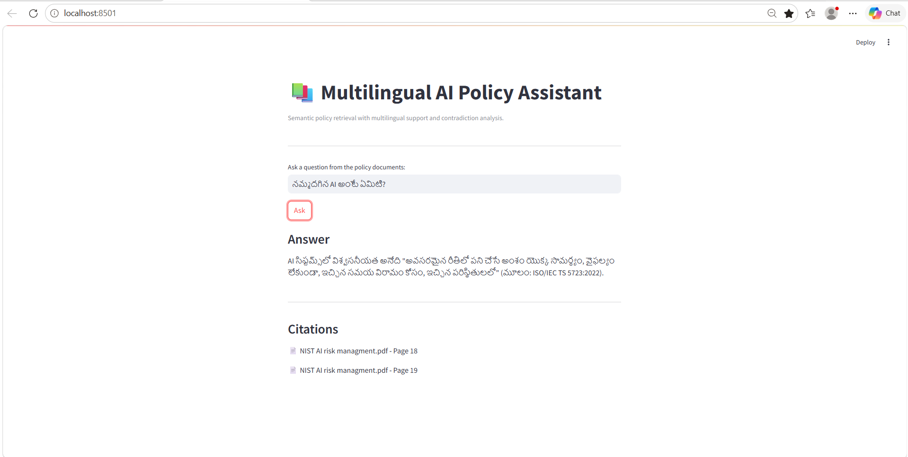
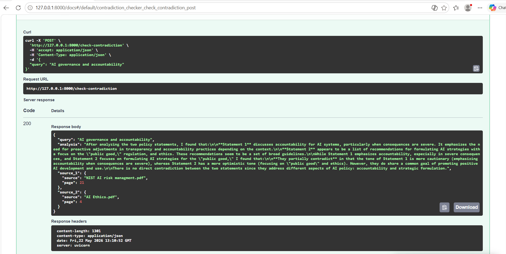

# AI Policy Assistant 🚀

An intelligent multilingual RAG-based policy analysis system built using FastAPI, Streamlit, FAISS, and LLMs.

This system allows users to:
- ask questions from policy PDFs
- retrieve grounded answers with citations
- interact in multiple languages
- detect contradictions across policy documents

---

# Screenshots

## Main Application



---

## Multilingual Support



---

## Contradiction Analysis



---

# Features

## Semantic Retrieval
- PDF ingestion
- intelligent chunking
- vector embeddings
- FAISS vector search

## Grounded AI Responses
- LLM-generated answers
- source citations
- policy-grounded retrieval

## Multilingual Support
- English ↔ Telugu query support
- automatic translation pipeline

## Contradiction Detection
- cross-document comparison
- agreement vs contradiction analysis

## Interactive UI
- Streamlit chatbot interface
- FastAPI backend
- Swagger API documentation

---

# Tech Stack

- Python
- FastAPI
- Streamlit
- FAISS
- Sentence Transformers
- Groq API
- Deep Translator

---

# Project Architecture

```text
User Query
    ↓
Streamlit UI
    ↓
FastAPI Backend
    ↓
Translation Layer
    ↓
Semantic Search (FAISS)
    ↓
LLM Reasoning
    ↓
Grounded Response + Citations
```

---

# Folder Structure

```text
app/
    api.py
    chunking.py
    contradiction.py
    embeddings.py
    llm.py
    pdf_reader.py
    retrieval.py
    translation.py
    vector_store.py

data/pdfs/

screenshots/
    home.png
    telugu-demo.png
    contradiction.png

ui/
    app.py

main.py
requirements.txt
README.md
```

---

# Setup Instructions

## Clone Repository

```bash
git clone <your-github-repo-url>
cd potens-intern-ai-ml-lalitha
```

---

## Create Virtual Environment

```bash
python -m venv venv
```

---

## Activate Environment

### Windows

```bash
.\venv\Scripts\activate
```

---

## Install Dependencies

```bash
pip install -r requirements.txt
```

---

# Run Backend

```bash
uvicorn app.api:app --reload
```

Backend:
```text
http://127.0.0.1:8000
```

Swagger Docs:
```text
http://127.0.0.1:8000/docs
```

---

# Run Frontend

Open new terminal:

```bash
streamlit run ui/app.py
```

Frontend:
```text
http://localhost:8501
```

---

# Example Queries

## QA

- What is trustworthy AI?
- Explain AI governance.
- What are ethical concerns in AI?

## Multilingual

- నమ్మదగిన AI అంటే ఏమిటి?

## Contradiction Analysis

- AI governance and accountability

---

# Challenges Faced

- Python virtual environment setup issues
- dependency conflicts between FastAPI and Pydantic
- cryptography DLL issues
- multilingual translation integration
- API integration debugging
- Swagger/OpenAPI compatibility issues
- GitHub large file handling

---

# Future Improvements

- persistent FAISS index storage
- response streaming
- authentication
- PDF upload support
- advanced contradiction scoring
- support for more languages
- cloud deployment
- conversation memory

---

# AI Tools Used

- ChatGPT
    - architecture guidance
    - debugging support
    - API integration assistance
    - multilingual pipeline design
    - documentation guidance

---

# Author

Lalitha  
MSc Data Science
